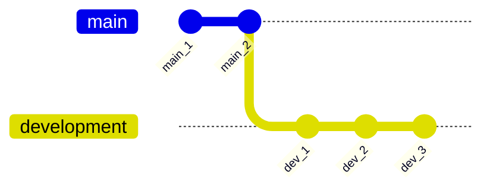

# Branches

Branches are used when you want to add a new feature to your project, implement a hotfix, etc.

### 1.4.1. Branch: Create

In order to create a new branch, you can use the `git branch` command.

```bash
# Create the branch 'development'
git branch development
```

### 1.4.2. Branch: Checkout

In order to start writing commits into your new `development` branch, you need to switch to it. In Git this is called `checkout`.

```bash
# Checkout (i.e. switch to) the 'development' branch
git checkout development
```

### 1.4.3. Example

Below is a simple visualisation to demonstrate this process:

1. `git init`
   - A new repository is made. `main` is the default branch.
2. Two commits are made on the `main` branch.
   - Therefore, twice a file has been added/modified; staged with `git add` and then committed with `git commit`.
3. A new branch called `development` is made with `git branch development`.
4. The `development` branch is switched to with `git checkout development`.
5. Three commits are made on the `development branch`.
   - Therefore, trice a file has been added/modified; staged with `git add` and then committed with `git commit`.

<br/>

