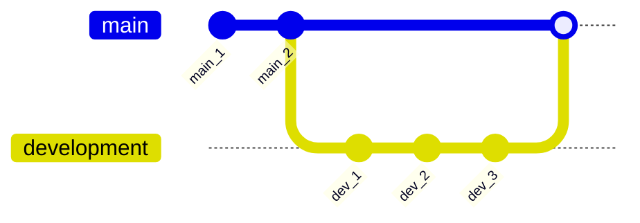

## 1.5. Merging

Merging is the process of combining the commits of one branch into another. 

For instance, if you have finished work on a branch `feature/preprocessing` and want to include this work in your `development` branch, you would merge the former into the latter.

### 1.5.1. Example

In the visualisation below, we are satisfied with the work on the `development` branch and subsequently want to merge this into our `main` branch.

```bash
# Ensure we are checked out in the branch we want to merge into
git checkout main

# Then merge the 'development' branch into the 'main' branch
git merge development
```
<br />


