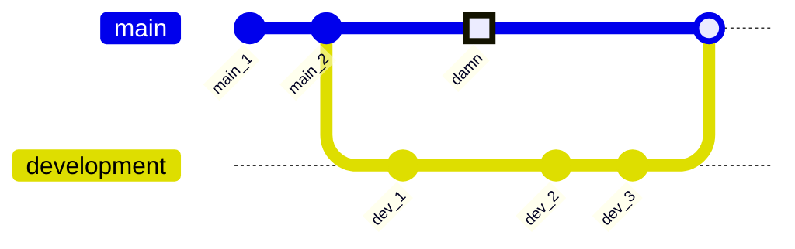
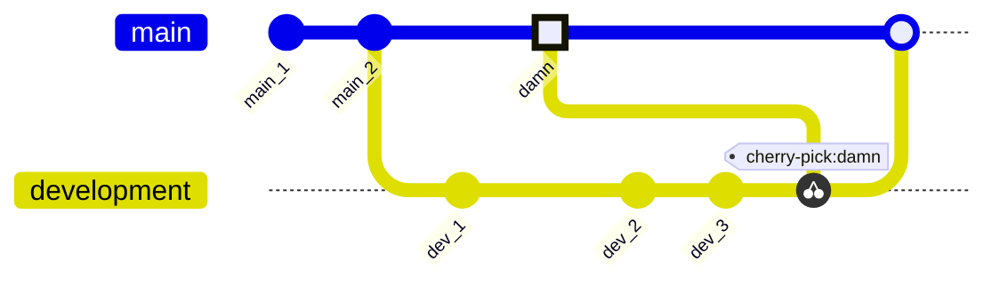

# Cherry Picking

It may happen that you have accidentally committed a change into the wrong branch or that, in hindsight, some prior commits actually make more sense in another branch. This is where cherry picking comes in.

Where `git merge` merges all commits of one branch into another branch, `git cherry-pick` lets you choose which specific comments you want to copy to another branch.

### 1.6.1. Example

The visualisation below is more or less the same as in the merging example above, only we were accidentally checked out in the `main` branch when we committed the commit with ID *damn*.

How do we fix this?

<br />



<br />

In order to fix this, we will use `git cherry-pick`:

```bash
# Ensure the branch we want to cherry pick the comment to is checked out
git checkout development

# Cherry pick the commit we want to move to 'development'
git cherry-pick damn
```

<br />



<br />

The commit has now been successfully copied to the `development` branch. However, note that it also still exists on the `main` branch.

This is the nature of Git; it essentially attempts to preserve as much history as possible.

However, if you do not want this commit in `main`, it is possible to remove it by rewriting history. I'll discuss this in the next section.