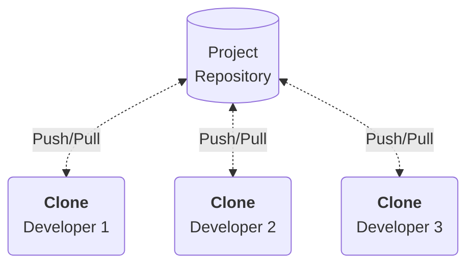
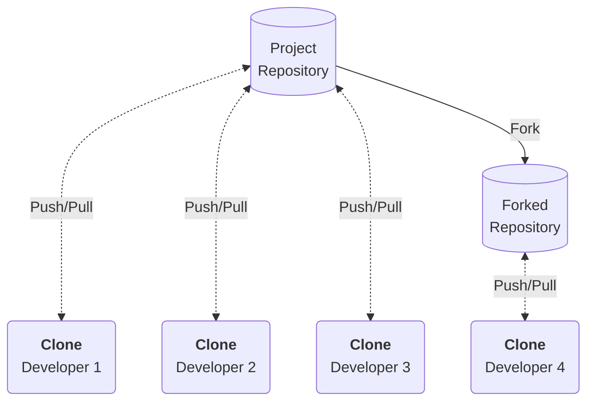

# Clone & Fork

When starting collaboration on an existing project, you need a way to tell Git where the existing remote repository resides, and you need to get an up-to-date copy of the existing codebase (local repository). There are two ways to do this: cloning or forking.

#### 1.9.1.1. Clone

The `git clone` command is perhaps the most well-known. This command allows you to reflect (i.e. make a copy) of the repository locally. Moreover, this automatically registers the repository, from which you clone, as the remote. This will enable you to *fetch* (retrieve changes made by others) from and *push* (submit your own changes) to this remote repository.

For example, I frequently contribute to open-source development projects, such as [PyTorch](https://pytorch.org/docs/master/community/contribution_guide.html): a popular deep learning framework. If you would want to do that as well, you would e.g. start by cloning the repository:

```bash
# Navigate to your programming projects folder
cd ~/coding/python

# Clone the repository
git clone https://github.com/pytorch/pytorch
```



#### 1.9.1.2. Fork

Forking a repository is a similar concept, but it differs vastly from cloning. 

When cloning, you copy the entire repository, along with its ties to the remote location (i.e. enabling you to *fetch* and *push*). A fork only copies the repository, but creates an entirely new codebase; there is no synchronisation.

A fork allows you to '*stand on the shoulders of giants*'; i.e. you can use an existing codebase as a foundation, but adapt the project to go into an entirely different direction. For example, *MariaDB* started as a fork from the well-known *MySQL*.

On a final note, forking is not a command available in Git itself. You can access it as a feature of services like *GitHub*, or *GitLab*. The reason why it is not a feature of the Git CLI is beyond the scope of this document.


