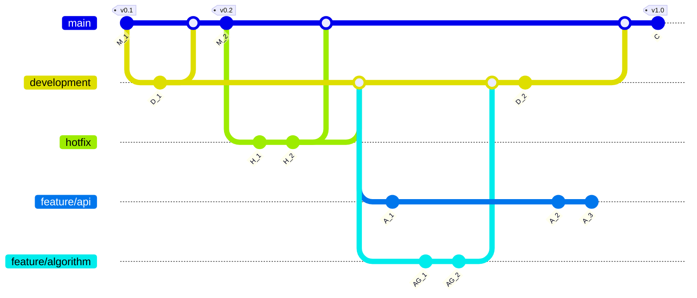

# Design

The design pattern I often use is a combination of the *Flow* and *Trunk* development paradigms. You can find a visual example below, as well as clarification on what purpose each branch serves.

#### 1.10.2.1. `main`

Should be the release branch. Only stable, production-grade code should reside here. The only branches that should merge into the `main` branch are `development` and `hotfix`. 

- `development` merges into `main` when a new release, with new features, is fully ready, (unit)tested and ready for the end user.
- `hotfix` merges into `main` to patch showstopping bugs or issues, if they occur.

#### 1.10.2.2. `development`

The experimental branch. Incorporates new features that are merged from feature branches. Also used for very minor development work on existing features that do not merit the creation of a new branch. The only branches that should merge into the `development` branch are `feature` branches and `hotfix`.

- `feature` branches merge into `development` when a feature is considered complete and is ready for testing.
- `hotfix` merges into `development` to incorporate the patch for showstopping bugs or issues, if they occur on the releases on `main`.

#### 1.10.2.3. `hotfix`

This is an emergency branch that is created directly from the latest release on the `main` branch to address a showstopping bug or issue that occurs there.

- It is deleted immediately after the patch code has been merged into `main` and `development`.
- Nothing should merge into `hotfix`.

#### 1.10.2.4. `feature/<name>`

These are branches that introduce entirely new features to the codebase, or revise/improve existing functionality.

- These branches merge into `development` and are deleted after the final feature or improvements have been completed.

 

