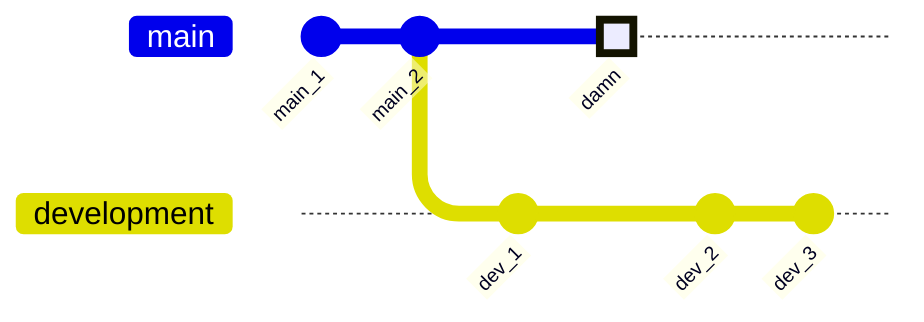
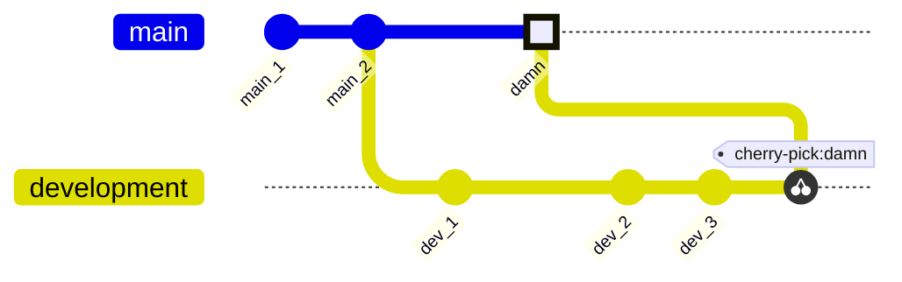

# Cherry picking

It may happen that you have accidentally committed a change into the wrong branch or that, in hindsight, some prior commits actually make more sense in another branch. This is where cherry picking comes in.

Where `git rebase` appends all commits of one branch onto another branch, `git cherry-pick` lets you choose which specific comments you want to 'copy' to another branch.

!!! note
    While `git rebase` is *destructive*, `git cherry-pick` is not. After cherry-picking the commits you want, the original branch still exists exactly as it was.

## Example: `git cherry-pick`

The visualisation below is more or less the same as the merging example in the previous section. However, this time, we were accidentally checked out in the `main` branch when we committed the commit with ID *damn*.



In order to fix this, we will use `git cherry-pick`:

```bash
# Ensure the branch we want to cherry pick the comment to is checked out
git switch development

# Cherry pick the commit we want to move to 'development'
git cherry-pick damn
```



The commit has now been successfully copied to the `development` branch. However, note that it also still exists on the `main` branch. This is the nature of Git: it essentially attempts to preserve as much history as possible.

However, if you do not want this commit in `main`, it is possible to remove it by entirely rewriting history. I'll discuss this in the next section.