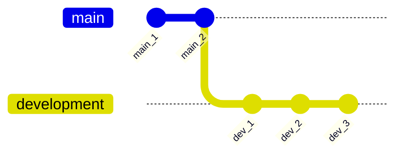

# Managing branches

## Creating a new branch

In order to create a new branch at your current location, you can use the `git branch` command. You can also create a branch at a different location. Refer to the examples below:

```bash
# Create the branch 'development' at current location (HEAD)
git branch development

# Create the branch 'bugfix' at commit with hash 'ab245'
git branch bugfix ab245
```

When subsequently calling `git branch` without an argument, Git shows all your branches, along with the active one:

```termcap
  development
* main
```

## Switching to a different branch

In order to start writing commits into the new `development` branch, we first need to switch to it. In Git this is called '*checking out*' and is accomplished using the `git switch` command. You can check out commits, as well as branches. But to keep things simple, we will stick to branches for now. 

```bash
# Checkout (i.e. switch to) the 'development' branch
git switch development

# Or using `checkout`
git checkout branch
```

??? note "`git switch` or `git checkout`?"
      A lot of online resources will point you towards the `git checkout` command. This still works fine in most cases. There is, however, a lot going on under the hood that makes the two commands perform differently from each other. 
      
      Stick to `git switch`, as it is the recommended approach in newer Git versions, unless you need specific options that only `git checkout` provides.

### Example

Below is a simple visualisation to demonstrate this process:

1. `git init`
      - A new repository is made. `main` is the default branch.
2. Two commits are made on the `main` branch.
      - Therefore, twice, a file has been added/modified; staged with `git add` and then committed with `git commit`.
3. A new branch called `development` is made with `git branch development`.
4. The `development` branch is switched to with `git switch development`.
5. Three commits are made on the `development branch`.
      - Therefore, three times, a file has been added/modified; staged with `git add` and then committed with `git commit`.



!!! tip
      To create a new branch, and immediately check it out, you can use the following shorthand: `git checkout -b <new_branch_name>`:

      ```bash
      # Create the branch 'development' and immediately check it out
      git checkout -b development
      ```

      To forcibly move a branch around, you can use: `git branch -f <branch_name> <new_location>`:

      ```bash
      # Set the current state of branch 'development' to be commit with hash 'td364' instead of HEAD
      git branch -f development td364
      ```
