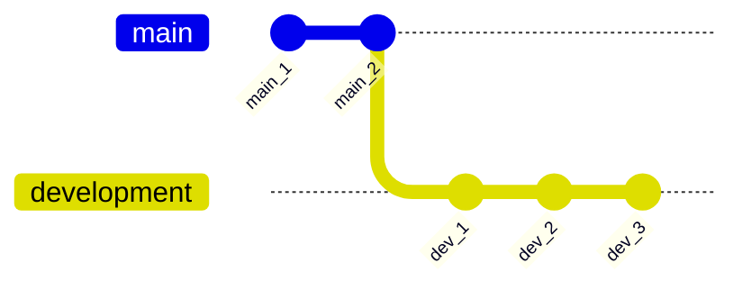

# Managing branches

## Creating a new branch

In order to create a new branch, you can use the `git branch` command:

```bash
# Create the branch 'development'
git branch development
```

When subsequently calling `git branch` without argument, Git shows all your branches, along with the active one :

```
  development
* main
```

## Switching to a different branch

In order to start writing commits into the new `development` branch, we first need to switch to it. In Git this is called '*checking out*' and is accomplished using the `git switch` command. You can check out commits, as well as branches. But to keep things simple, we will stick to branches for now. 

```bash
# Checkout (i.e. switch to) the 'development' branch
git switch development
```

!!! note
    A lot of online resources will point you towards the `git checkout` command. While this still works fine in most cases, there is a lot going on under the hood that makes it perform differently. Stick to `git switch`, as it is the recommended approach in newer Git versions.

### Example

Below is a simple visualisation to demonstrate this process:

1. `git init`
      - A new repository is made. `main` is the default branch.
2. Two commits are made on the `main` branch.
      - Therefore, twice, a file has been added/modified; staged with `git add` and then committed with `git commit`.
3. A new branch called `development` is made with `git branch development`.
4. The `development` branch is switched to with `git switch development`.
5. Three commits are made on the `development branch`.
      - Therefore, trice, a file has been added/modified; staged with `git add` and then committed with `git commit`.

