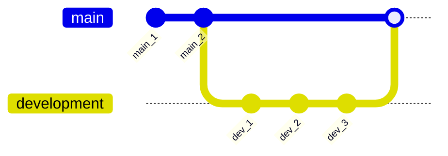
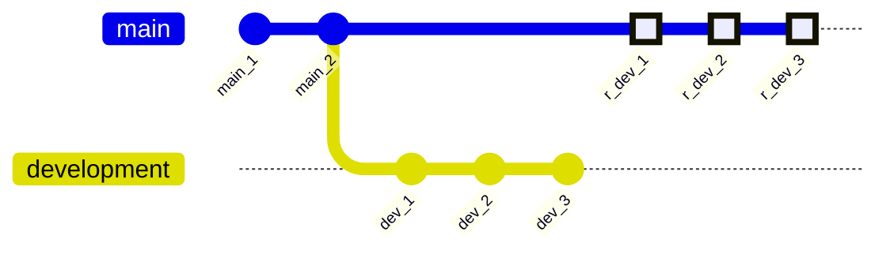

# Merging and rebasing

## Merging

Merging is the process of combining the commits of one branch into another. It pulls in all changes since the time the branch's history diverged from the current branch.

For instance, if you have finished work on a branch `feature/preprocessing`, and want to include these changes in your `development` branch, you would merge the former into the latter.

### Example: `git merge`

In the visualisation below, we are satisfied with the work on the `development` branch and subsequently want to merge it into our `main` branch.

```bash
# Ensure we are checked out in the branch we want to merge into
git switch main

# Then merge the 'development' branch into the 'main' branch
git merge development
```



## Rebasing

Rebasing is kind of similar to merging. When rebasing, you move and combine the commits of another branch and 'append' them to the current branch.

### Example: `git rebase`

In the visualisation below, we are once again satisfied with the work on the `development` branch and subsequently want to rebase it onto our `main` branch.

As *Mermaid* graphs do not support rebase as in its syntax, I have constructed it in a poor man's way below. The highlighted commits on `main` prefixed with `r_` denote the commits rebased onto the `main` branch from the `development` branch.

```bash
# Ensure we are checked out in the branch we want to rebase onto another branch
git switch development

# Then rebase the active branch onto the 'main' branch
git rebase main

# Then advance (fast-forward) the main branch to the newest commit
git switch main
git rebase feature
```



!!! question "When to use `git rebase` over `git merge`?"
    First and foremost, `rebase` has some inherent dangers for beginners. The short version is that, among other things, `rebase` is *destructive*; which can be catastrophic in a *DevOps* workflow, whereas `merge` is not. Therefore, it is safer for beginners to stick to `merge`. Also, as a general rule of thumb, never `rebase` when working in public repositories.

    Having said that, using `rebase` over `merge` allows for a much cleaner, and linear, project history. This, in turn, makes commands like `git log` and `git bisect` easier to navigate with. Furthermore, one of the best features of `rebase` is the `i` flag, which triggers an interactive rebase. This allows the developer to clean up the commit history while rebasing. Learn more about it [here](https://www.sitepoint.com/git-interactive-rebase-guide/).