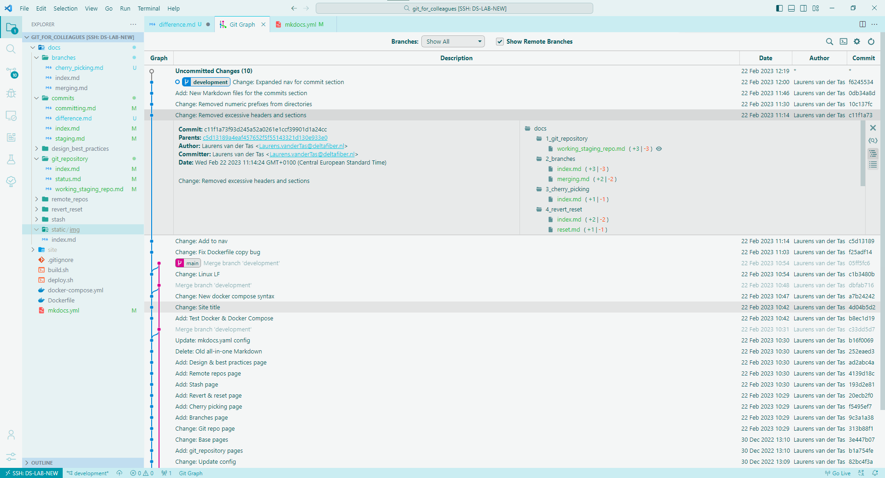
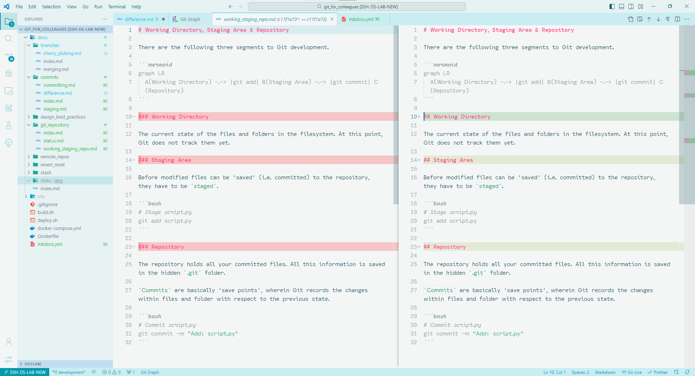

# Inspecting differences

As said previously, committing the same file again, after changes have been made to it, makes Git track the changes.

In order to show the differences in a file(s), relative to previous versions, you could use the `git diff` command. However, due to the sheer amount of typing involved in specifying the arguments to do so, I prefer using the *Git Graph* extension in *VSCode* for this.

## Git Graph

Commit history:

{ data-title="Git Graph: Commit history" data-description="Preview of Git Graph with a history of all commits across all branches." }

Changes in specific file with respect to previous commit:

{ data-title="Git Graph: Specific file changes" data-description="Shows changes made in file with respect to a previous commit." } 