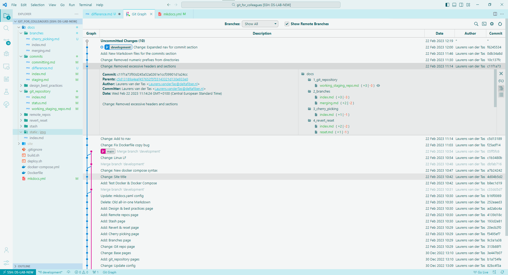
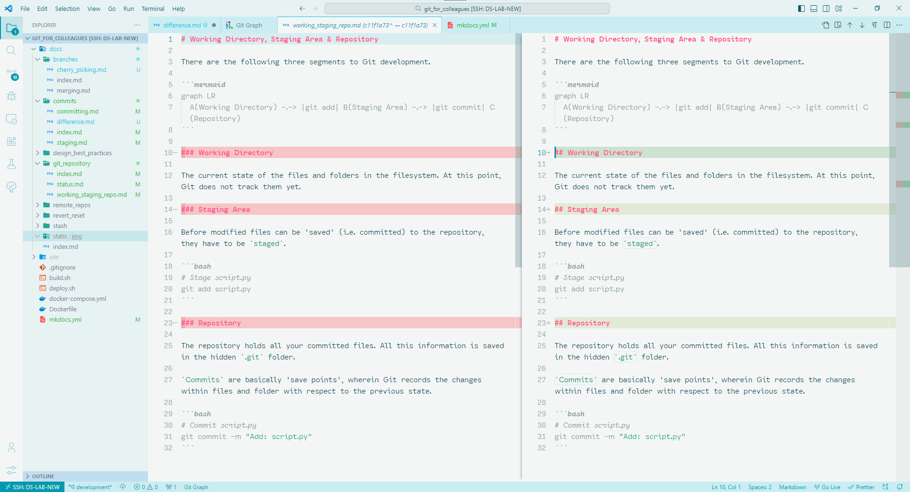

# Inspecting differences

As said previously, committing the same file again, after changes have been made to it, makes Git track the changes.

In order to show the differences in a file(s), relative to previous versions. One of the easiest, and most visually clear way to do this, is by using the [*Git Graph*](https://marketplace.visualstudio.com/items?itemName=mhutchie.git-graph) extension in *VSCode*.

## Git Graph

**Commit history:**

{ data-title="Git Graph: Commit history" data-description="Preview of Git Graph with a history of all commits across all branches." }

**Changes in specific file with respect to previous commit:**

{ data-title="Git Graph: Specific file changes" data-description="Shows changes made in file with respect to a previous commit." }

## Git CLI

There are multiple ways to inspect changes to a file using the Git CLI. I will show you two examples using `git log`.

**Show all commits that have made changes to a specific file:**

> `git log --follow <filename>`

```bash
git log --follow docs/commits/committing.md
```

Terminal output (truncated):

```termcap
commit 90881e6ef792aa3351d9bbf5191f7b8cb314251a
Author: Laurens van der Tas <Laurens@email.nl>
Date:   Mon Feb 27 13:49:03 2023 +0100

    Change: Cleanup from proof reading

commit c9df343a6121d5573c1ce545113ddc82686362d3
Author: Laurens van der Tas <Laurens@email.nl>
Date:   Wed Feb 22 12:42:41 2023 +0100

    Change: Fixes and expansion commits section

commit 0db34a8d2f207fcf61539a2f8d13c4e0278385d7
Author: Laurens van der Tas <Laurens@email.nl>
Date:   Wed Feb 22 11:46:07 2023 +0100
```

**Show detailed changes that have been made to a file by commit:**

> `git log -p <filename>`

```bash
git log -p docs/commits/committing.md
```

Terminal output (truncated):

```termcap
commit 90881e6ef792aa3351d9bbf5191f7b8cb314251a
Author: Laurens van der Tas <Laurens@email.nl>
Date:   Mon Feb 27 13:49:03 2023 +0100

    Change: Cleanup from proof reading

diff --git a/docs/commits/committing.md b/docs/commits/committing.md
index 086ea1a..1fc2263 100644
--- a/docs/commits/committing.md
+++ b/docs/commits/committing.md
@@ -17,4 +17,6 @@ Upon running this, you will get a message like the following:
 ```
 
 !!! info
-    I have now created a commit (i.e. 'save point') for these two files in their current state. I have included them both in a single commit, because that makes sense here; both files are part of the content section about commits in my project.
:...skipping...
```