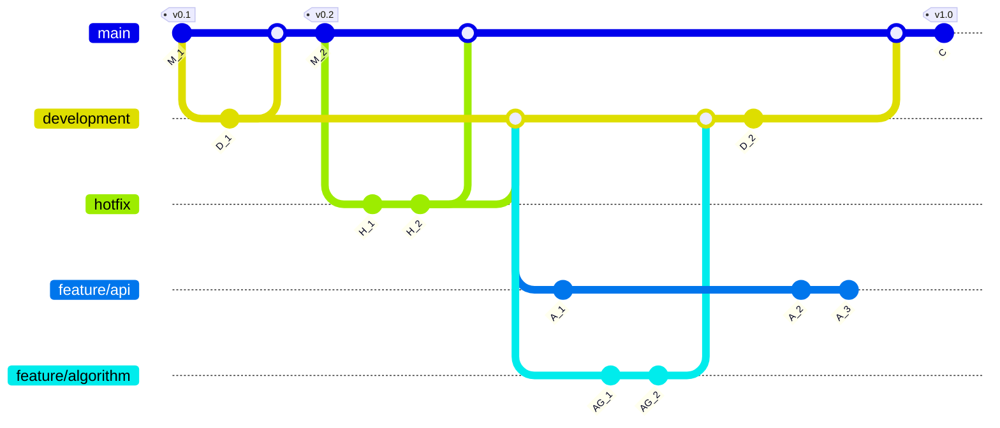

# Design

The design pattern I often use borrows ideas of both the [*Flow*](https://nvie.com/posts/a-successful-git-branching-model/) and [*Trunk*](https://www.split.io/glossary/trunk-based-development/#:~:text=Trunk%2Dbased%20development%20(TBD),%2C%20the%20%E2%80%9Cmaster%20branch%E2%80%9D.) paradigms, as shown in the visualisation below. Moreover, further down below, I have included a clarification on what purpose each branch serves.

## Branch: `main`

This should be the '*release*' branch. Only stable, production-grade code should reside here. The only branches that should merge into the `main` branch are the `development` and `hotfix` branches. 

- The `development` branch merges into `main` when a new release, with new features, has been completed, tested, and is ready for the end user.
- The `hotfix` branch merges into `main` to patch showstopping bugs or issues, if they occur.

## Branch: `development`

This should be the '*experimental*' branch. It incorporates new features that have been merged from feature branches. Furthermore, it is used for very minor development work on existing features that do not merit the creation of a new branch. The only branches that should merge into the `development` branch are `feature` branches and the `hotfix` branch.

- The `feature` branches merge into `development` when a feature is considered complete and is ready for testing.
- The `hotfix` branch merges into `development` to incorporate patches for showstopping bugs or issues, should they occur on the live application on `main`.

## Branch: `hotfix`

This is an emergency branch that is created directly from the latest release on the `main` branch to address a showstopping bug or issue that might occur there.

- The branch is deleted immediately after the changes have been merged into `main` and `development`.
- Nothing should merge into the `hotfix` branch.

## Branch: `feature`

These are branches that introduce entirely new features to the codebase, or revise/improve upon existing functionality.

- These branches merge into the `development` branch, and are deleted after the final feature, or improvements, have been completed.