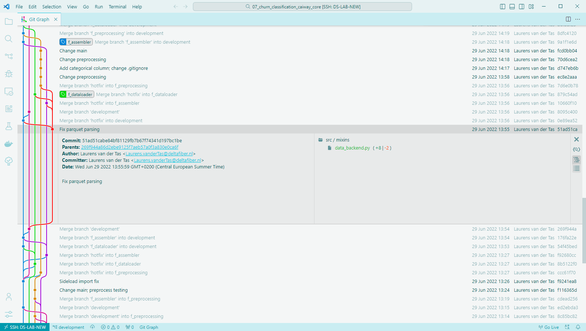

# Tools & Extensions

You can, of course, perform your entire Git workflow using the Git CLI in your Terminal. Moreso, I heavily recommend at least understanding, and performing, the basic Git workflow using the CLI at least once. This will help you build some familiarity and muscle memory.

I still use the CLI for some Git operations on a daily basis. A prime example is interactive rebasing. The CLI provides a fine-grained amount of control that most tools and extensions with a UI do not provide. 

Nevertheless, manually staging every single change, and constantly consulting your `git log` and `git reflog` in the CLI can be tedious and exhausting. Luckily, there are tools and extensions available that will make your life a lot easier. I will list some here.

## [Git Graph](https://marketplace.visualstudio.com/items?itemName=mhutchie.git-graph)

This extension is my very favourite and, in my opinion, an absolute must-have for everybody working with Git repositories using *Visual Studio Code*. 

It provides a tree-based visualisation of your entire repository. Furthermore, it provides options for easily checking out, creating branches, merging branches, cherry-picking, etc. from within the UI.

{ data-title="Git Graph" data-description="An example of the visualisation <i>Git Graph</i> provides." width="100%" }

## [GitLens](https://marketplace.visualstudio.com/items?itemName=eamodio.gitlens)

This extension is quite possibly capable of doing everything Git-related from within *Visual Studio Code*.

Unfortunately, the full feature set is for paying users only, so I cannot comment on the full user experience. However, I am quite sure this extension would enable you to forget about the Git CLI entirely and handle every operation through the extension's UI instead.

## [GitHub Pull Requests and Issues](https://marketplace.visualstudio.com/items?itemName=GitHub.vscode-pull-request-github)

This extension provides an interface to manage issues and pull requests from within *Visual Studio Code.*

