## 1.4. Branches

Branches are used when you want to add a new feature to your project, implement a hotfix, etc.

### 1.4.1. Branch: Create

In order to create a new branch, you can use the `git branch` command.

```bash
# Create the branch 'development'
git branch development
```

### 1.4.2. Branch: Checkout

In order to start writing commits into your new `development` branch, you need to switch to it. In Git this is called `checkout`.

```bash
# Checkout (i.e. switch to) the 'development' branch
git checkout development
```

### 1.4.3. Example

Below is a simple visualisation to demonstrate this process:

1. `git init`
   - A new repository is made. `main` is the default branch.
2. Two commits are made on the `main` branch.
   - Therefore, twice a file has been added/modified; staged with `git add` and then committed with `git commit`.
3. A new branch called `development` is made with `git branch development`.
4. The `development` branch is switched to with `git checkout development`.
5. Three commits are made on the `development branch`.
   - Therefore, trice a file has been added/modified; staged with `git add` and then committed with `git commit`.

<br/>

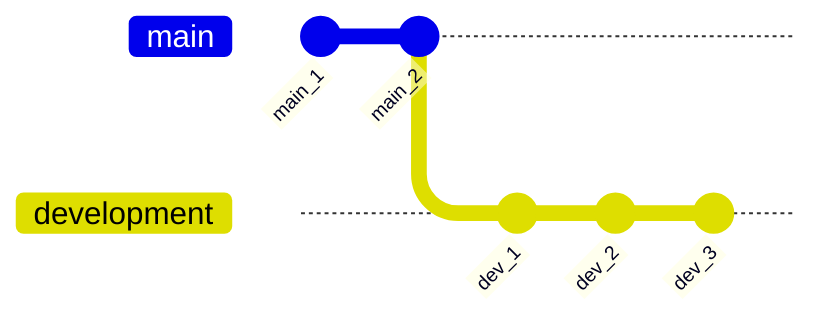

## 1.5. Merging

Merging is the process of combining the commits of one branch into another. 

For instance, if you have finished work on a branch `feature/preprocessing` and want to include this work in your `development` branch, you would merge the former into the latter.

### 1.5.1. Example

In the visualisation below, we are satisfied with the work on the `development` branch and subsequently want to merge this into our `main` branch.

```bash
# Ensure we are checked out in the branch we want to merge into
git checkout main

# Then merge the 'development' branch into the 'main' branch
git merge development
```
<br />

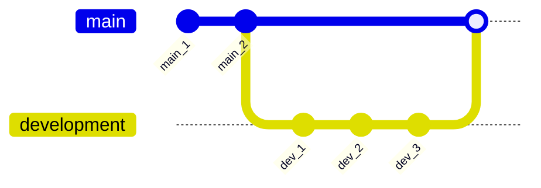

## 1.6. Cherry Picking

It may happen that you have accidentally committed a change into the wrong branch or that, in hindsight, some prior commits actually make more sense in another branch. This is where cherry picking comes in.

Where `git merge` merges all commits of one branch into another branch, `git cherry-pick` lets you choose which specific comments you want to copy to another branch.

### 1.6.1. Example

The visualisation below is more or less the same as in the merging example above, only we were accidentally checked out in the `main` branch when we committed the commit with ID *damn*.

How do we fix this?

<br />

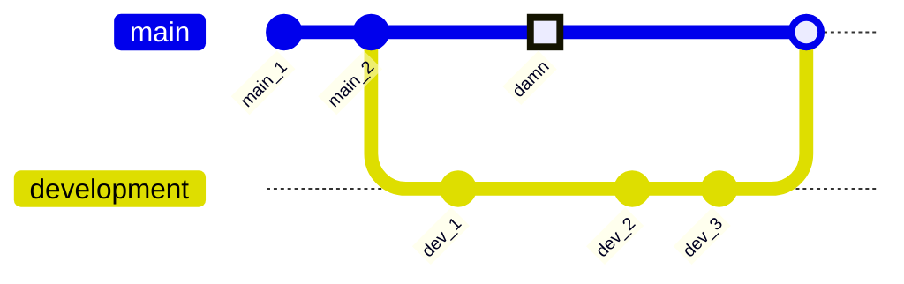

<br />

In order to fix this, we will use `git cherry-pick`:

```bash
# Ensure the branch we want to cherry pick the comment to is checked out
git checkout development

# Cherry pick the commit we want to move to 'development'
git cherry-pick damn
```

<br />

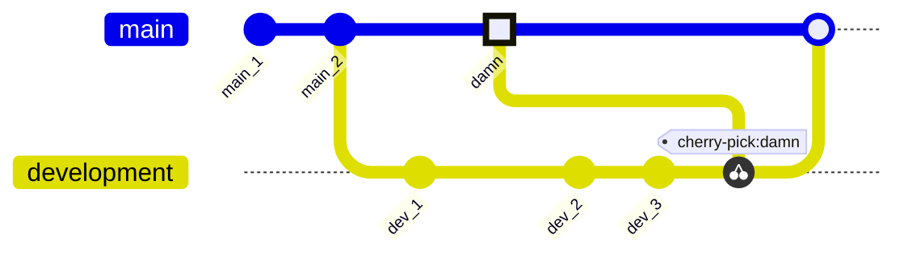

<br />

The commit has now been successfully copied to the `development` branch. However, note that it also still exists on the `main` branch.

This is the nature of Git; it essentially attempts to preserve as much history as possible.

However, if you do not want this commit in `main`, it is possible to remove it by rewriting history. I'll discuss this in the next section.

## 1.7. Revert & Reset

It may happen that you make a mistake in a commit and want to undo this. There are several ways to go about this, but I will discuss `git revert` and `git reset` here.

### 1.7.1. Revert

`git revert` is the friendly way of undoing a commit and, frankly, the only socially acceptable way to do it if you are working in remote repositories with a lot of contributors.

It works in the way that it adds a new commit to the current branch that undoes the changes of the commit you want revoked. For example, if the unwanted commit adds "123" to the bottom of the file, the revert on that commit will remove "123" from the bottom of that file.

#### 1.7.1.1. Example

We have accidentally committed a change in the `development` branch with commit ID `damn`. We want to use `git revert` to undo this change.

```bash
# Ensure we are checked out in the right branch
git checkout development

# Revert the unwanted comment
git revert damn
```

<br />

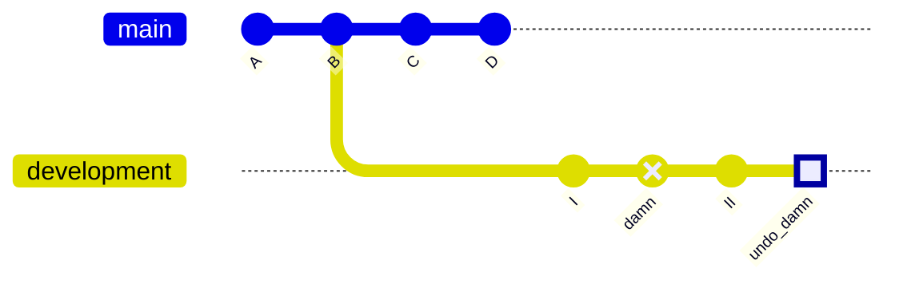

### 1.7.2. Reset

`git reset` is primarily a way to clear staged changes. Consider the following example:

```bash
# Let's stage two arbitrary files
git add script.py
git add README.md

# If we would want to unstage README.md
git reset README.md

# Or if we would want to unstage all files
git reset
```

However, the command also be made a lot meaner by using the `--hard` argument. This way, the command can be used to hard delete commits. Comments reset this way will be entirely removed from the commit history and cannot be retrieved.

#### 1.7.2.1. Example

We have accidentally committed a change in the `development` branch with commit ID `damn`. We want to use `git reset --hard` to completely obliterate this mistake from the annals of history.

<br />

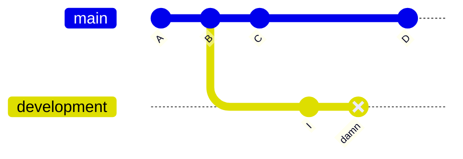

```bash
# Ensure we are checked out in the proper branch
git checkout development

# Hard reset the branch one commit back from the current checked-out state
git reset --hard HEAD~1
```

<br />

This will result in the following commit history:

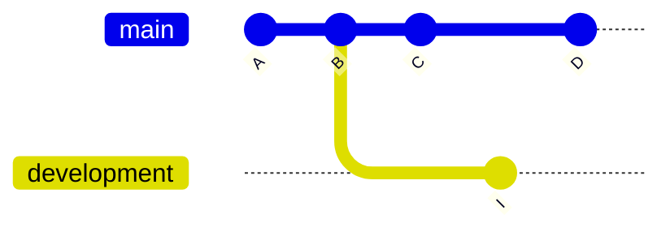

### 1.7.3. Advanced: Regarding `HEAD`

In Git, `HEAD` is a pointer that refers to the current state of the commit, or branch, that you are checking out. This means that the filesystem reflects the reality as per that commit/branch.

* If you check out a branch, your `HEAD` state will be equal to the current state of that branch.
* If you check out a specific commit, your `HEAD` state will be equal to the current state of that commit.

Simply put, checking out different branches, or commits, will change the files you see in the repository. That is the `HEAD` pointer in action.

#### 1.7.3.1. Relative Referencing

In the command `git reset --hard HEAD~1`, you will notice the `~1` part. This translates to 'go back one commit from the current `HEAD` state'. 

Consequently:

* `~` denotes going back in history.
  * `HEAD~4` would mean 'go back four commits from the current `HEAD` state'.
* `^` denotes going forward in history.
  * `HEAD^2` would mean 'go forward two commits from the current `HEAD` state'.

## 1.8. Stash

Imagine you are hard at work writing amazing code for a new feature, and then you realize you are still checked out on another branch. That sucks. 

Don't worry; you don't need to manually move all code and every file around. Git has you covered with `git stash`.

### 1.8.1. Example

```bash
# Stage some arbitrary changes in the INDEX
git add script.py
git add __init__.py
git add LICENSE

# Stash the changes
git stash

# Create the new branch and check it out
git branch feature/awesome
git checkout feature/awesome

# List all stashes to find index number associated with your stash
git stash list

# Apply the stash to the branch
git stash apply 0

# Commit the changes
git commit -m "From stash"

# Clean up the stash
git stash drop 0
```

I hacked together the visualisation below to give you some visual representation of what is going on. It is not entirely accurate, but I hope it conveys the idea.

<br />

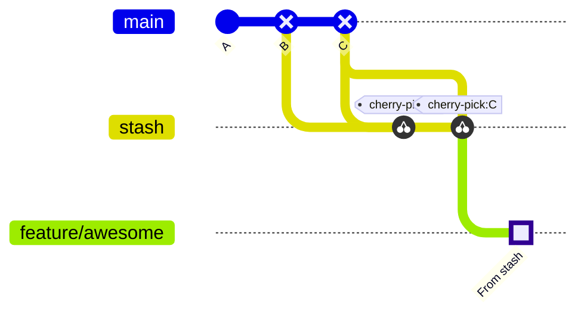

## 1.9. Remote Repositories

A lot of people are familiar with services like *GitHub* and *GitLab*, but do not even know Git itself is the driving piece of software behind it. 

Actually, this is not that strange, because the power of Git enables large groups of developers to work on a project concurrently, whilst keeping track of all changes in the grand scheme of things.

This collaboration is achieved using remote repositories.

### 1.9.1. Clone & Fork

When starting collaboration on an existing project, you need a way to tell Git where the existing remote repository resides, and you need to get an up-to-date copy of the existing codebase (local repository). There are two ways to do this: cloning or forking.

#### 1.9.1.1. Clone

The `git clone` command is perhaps the most well-known. This command allows you to reflect (i.e. make a copy) of the repository locally. Moreover, this automatically registers the repository, from which you clone, as the remote. This will enable you to *fetch* (retrieve changes made by others) from and *push* (submit your own changes) to this remote repository.

For example, I frequently contribute to open-source development projects, such as [PyTorch](https://pytorch.org/docs/master/community/contribution_guide.html): a popular deep learning framework. If you would want to do that as well, you would e.g. start by cloning the repository:

```bash
# Navigate to your programming projects folder
cd ~/coding/python

# Clone the repository
git clone https://github.com/pytorch/pytorch
```

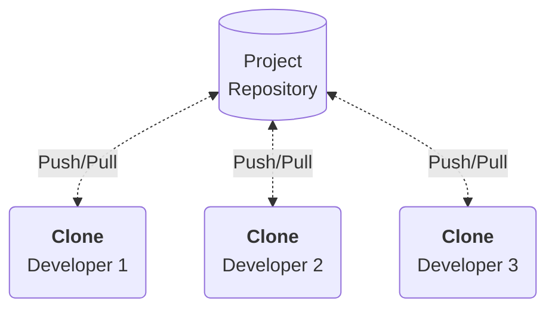

#### 1.9.1.2. Fork

Forking a repository is a similar concept, but it differs vastly from cloning. 

When cloning, you copy the entire repository, along with its ties to the remote location (i.e. enabling you to *fetch* and *push*). A fork only copies the repository, but creates an entirely new codebase; there is no synchronisation.

A fork allows you to '*stand on the shoulders of giants*'; i.e. you can use an existing codebase as a foundation, but adapt the project to go into an entirely different direction. For example, *MariaDB* started as a fork from the well-known *MySQL*.

On a final note, forking is not a command available in Git itself. You can access it as a feature of services like *GitHub*, or *GitLab*. The reason why it is not a feature of the Git CLI is beyond the scope of this document.

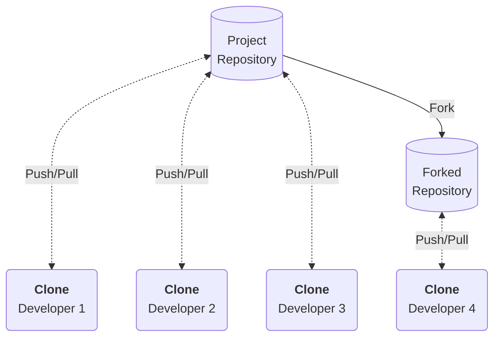

### 1.9.2. Remote Branches

When working with remote repositories, you get so-called remote-tracking branches. Remote-tracking branches are references to the state of remote branches. The names of these branches take the form of `<remote>/<branch>`, e.g. `origin/development`. 

You cannot directly manipulate these branches yourself. Git will automatically do this whenever any network communication occurs to make sure they accurately represent the state of the remote repository.

> Think remote-tracking branches as bookmarks: they remind you where the branches in your remote repositories were the last time you connected to them.

#### 1.9.2.1. Manipulating Remotes

When you clone a repository, using `git clone`, Git will automatically know the location of the remote. However, you can also manually add or remove remotes:

```bash
# Manually add a remote for the current repository: git remote add <name> <url>
git remote add origin git@ssh.dev.azure.com:v3/deltafibernl/BICC/Placeholder

# Manually remove a remote for the current repository: git remote rm <name>
git remote rm origin
```
#### 1.9.2.2. Example

Consider the example below:

- `origin/main`: Remote-tracking branch of remote `main` branch.
- `origin/feature/algorithm`: Remote-tracking branch of remote `feature/algorithm` branch.
- `main`: Local state of `main` branch.
- `feature/api`: Local `feature/api` branch.

The following happens:

1. The repository is cloned locally.
2. A commit is made in `main` (local).
3. A new branch `feature_api` is made and a commit is made in it (local).
4. A collaborating developer pushed a commit to the remote `main` branch, reflected in remote-tracking branch `origin/main`.
5. A collaborating developer pushed a new remote branch `feature/algorithm` with a commit in it, as reflected in remote-tracking branch `origin/feature/algorithm`.
6. A collaborating developer pushed another commit to the remote `main` branch, reflected in remote-tracking branch `origin/main`.

> Note that we do not locally have the remote changes, made by the collaborating developers, until we retrieve them (either using `git fetch` with `git merge`, or `git pull`).

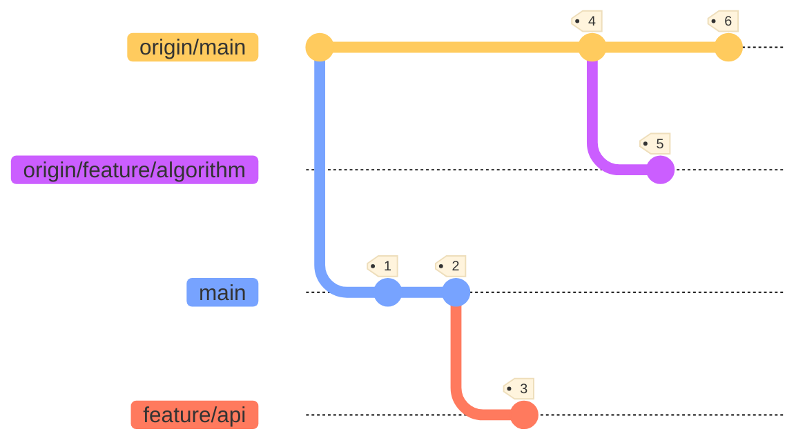

### 1.9.3. Fetch, Pull & Push

In order te retrieve changes made by others, and submit your own changes to the remote, Git provides the `git fetch`, `git pull` and `git push` commands.

#### 1.9.3.1. Fetch

The `git fetch` commands downloads all commits, files and refs from a remote repository into your local repository. Fetched content is isolated from existing local content, which makes it safe. You can review all fetched commits before merging them with your existing work.

```bash
# Fetch all branches from remote: git fetch <remote>
git fetch origin

# Fetch specific branch from remote: git fetch <remote> <branch>
git fetch origin development

# Fetch all registered branches from across all remotes
git fetch --all
```

#### 1.9.3.2. Pull

The `git pull` command is more aggressive. Not only will it download all commits, files and refs from the remote repository; it will also immediately call `git merge` to integrate it. If you already have pending changes, this may cause merge conflicts which you need to resolve.

```bash
# Checkout local 'development' branch
git checkout development

# Fetch remote's state of current branch and merge it into local: git pull <remote>
git pull origin

# This does exactly the same thing, only using 'fetch' and 'merge' separately
git fetch origin development
git merge origin/development

# Fetch remote's state of current branch and rebase it onto local: git pull --rebase <remote>
git pull --rebase origin
```

#### 1.9.3.3. Push

The `git push` command uploads changes in the local repository to a remote. It is the counterpart of `git fetch`.

```bash
# Push specific local branch to remote: git push <remote> <branch>
git push origin development

# Push all local branches to remote: git push <remote> --all
git push origin --all
```

#### 1.9.3.4. Pull Requests

In order to manage code quality in remote repositories, such as on *GitHub*, *GitLab* or *Azure DevOps*, not everybody can simply push and merge changes in whatever branch they feel like. This is where a *pull request* (PR) comes in.

In their simplest form, pull requests are a mechanism for a developer to notify team members that they have completed a feature. Once their feature branch is ready, the developer files a pull request, which lets everybody involved know that they need to review the code and merge it into the main branch.

However, a pull request is more than this. It also provides a space to discuss the feature, or any issues with it, and/or provide feedback. Furthermore, the changes made within the pull request can even be altered and improved by follow-up commits.

> The Git CLI does have the `git request-pull` command, however pull requests are generally issued from within the service where the remote repository is hosted. This provides a lot more flexibility.

## 1.10. Design & Best Practices

There are a lot of best practices when it comes to branching and committing. I will go over a couple of them here. It is no comprehensive list, so feel free to look around on the Internet.

### 1.10.1. Best Practices

- Branch early and branch often:
   - Are you starting work on a new aspect/feature? Create a branch! This will save you the hassle of needing to rewrite the history of your repository later.
- Delete branches when their purpose has been served and the changes have been merged:
  - This will make your repository a lot easier to work with. Stale branches cause a lot of clutter and confusion.
- Branch naming conventions:
   - The default branch is always called `main` (formerly `master`).
   - Be clear and consistent in additional branch naming (e.g. `f_preprocessing`, or better `feature/preprocessing`).
- Be consistent in commit message structure:
   - Use prefixes, such as e.g. *Add*, *Delete*, *Change*.
   - Examples: 
      - *Add: SQL feeds*
      - *Change: Data ingress handler*
      - *Delete: Debug script* 

### 1.10.2. Design

The design pattern I often use is a combination of the *Flow* and *Trunk* development paradigms. You can find a visual example below, as well as clarification on what purpose each branch serves.

#### 1.10.2.1. `main`

Should be the release branch. Only stable, production-grade code should reside here. The only branches that should merge into the `main` branch are `development` and `hotfix`. 

- `development` merges into `main` when a new release, with new features, is fully ready, (unit)tested and ready for the end user.
- `hotfix` merges into `main` to patch showstopping bugs or issues, if they occur.

#### 1.10.2.2. `development`

The experimental branch. Incorporates new features that are merged from feature branches. Also used for very minor development work on existing features that do not merit the creation of a new branch. The only branches that should merge into the `development` branch are `feature` branches and `hotfix`.

- `feature` branches merge into `development` when a feature is considered complete and is ready for testing.
- `hotfix` merges into `development` to incorporate the patch for showstopping bugs or issues, if they occur on the releases on `main`.

#### 1.10.2.3. `hotfix`

This is an emergency branch that is created directly from the latest release on the `main` branch to address a showstopping bug or issue that occurs there.

- It is deleted immediately after the patch code has been merged into `main` and `development`.
- Nothing should merge into `hotfix`.

#### 1.10.2.4. `feature/<name>`

These are branches that introduce entirely new features to the codebase, or revise/improve existing functionality.

- These branches merge into `development` and are deleted after the final feature or improvements have been completed.

<br />

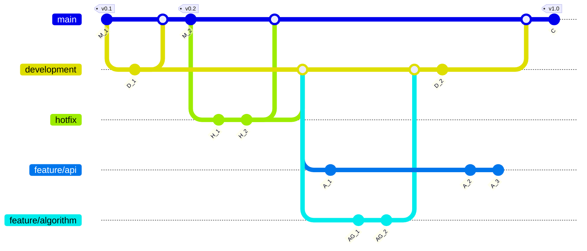