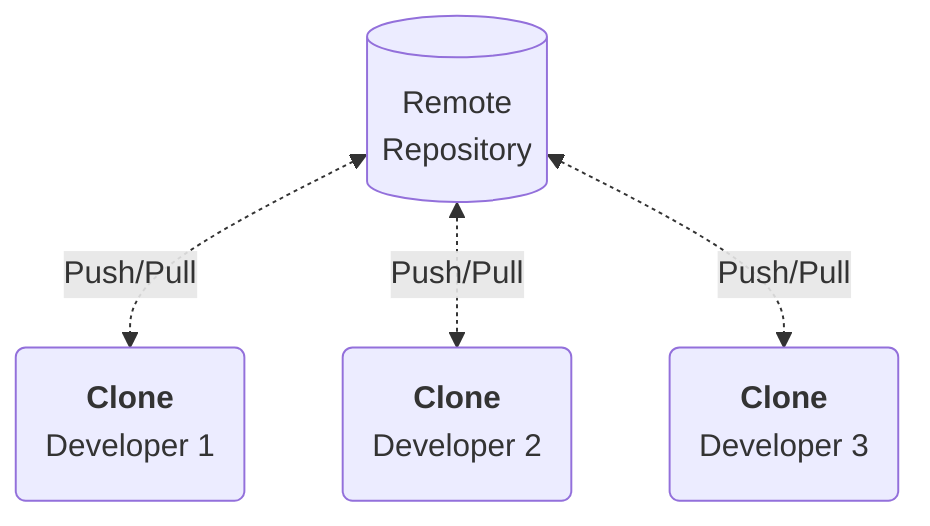
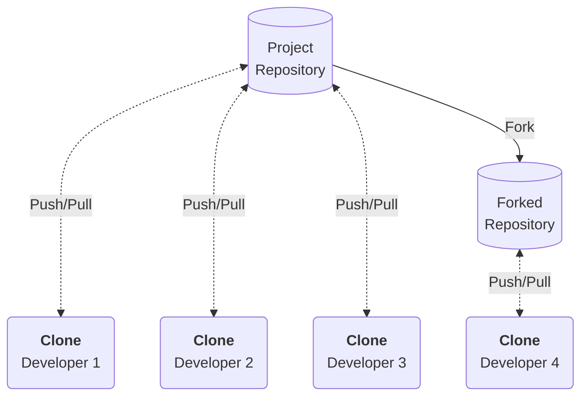

# Clone & Fork

When starting collaboration on an existing project, you need a way to tell Git where the remote repository you want to collaborate on resides, and you need to get a local copy of said codebase to work on for yourself. There are two ways to do this: *cloning* the repository, or *forking* the repository.

## Cloning

The `git clone` command is perhaps the most well-known. This command allows you to reflect (i.e. make a copy) the repository, in its current state, locally. Moreover, this automatically registers this source repository as the remote repository within Git. This will enable you to `git fetch` commits and branches (retrieve changes made by others) *from* the remote repository, and `git push` (submit your own changes and branches) *to* this remote repository.

For example, I frequently contribute to open-source development projects, such as [PyTorch](https://pytorch.org/docs/master/community/contribution_guide.html): a popular deep learning framework. If you would want to do that as well, you would start by cloning the repository:

```bash
# Navigate to the directory you want to store the cloned repository
cd ~/coding/python

# Clone the Pytorch repository
git clone https://github.com/pytorch/pytorch

# Change directory to the repository
cd pytorch
```

As visualised below, this workflow enables multiple developers to work on the same project (repository) at the same time.



## Forking

Forking a repository is a similar concept to cloning, but there a some differences.

When using `git clone`, you copy the entire repository, along with its ties to the remote location, thus enabling you to `git fetch` *from* it and `git push` *to* it. A fork *only* copies the repository, but creates an entirely new and separated codebase. There is no synchronisation between your fork and the original repository, in the sense that you could *push* to it, or *pull* from it, as you would have been able to when cloning. In Git terms: It does not register the source as a remote repository for your local repository.



A fork allows you to essentially '*stand on the shoulders of giants*'; i.e. you can use an existing codebase as a foundation, but adapt the project to go in an entirely different direction. For example, the *MariaDB* database application started as a fork from the well-known *MySQL* database application.

!!! note
    Fork is not a command available within Git itself. You can access forking as a feature of services like *GitHub*, or *GitLab*. The reason why it is not a feature of the Git CLI is beyond the scope of this document.
