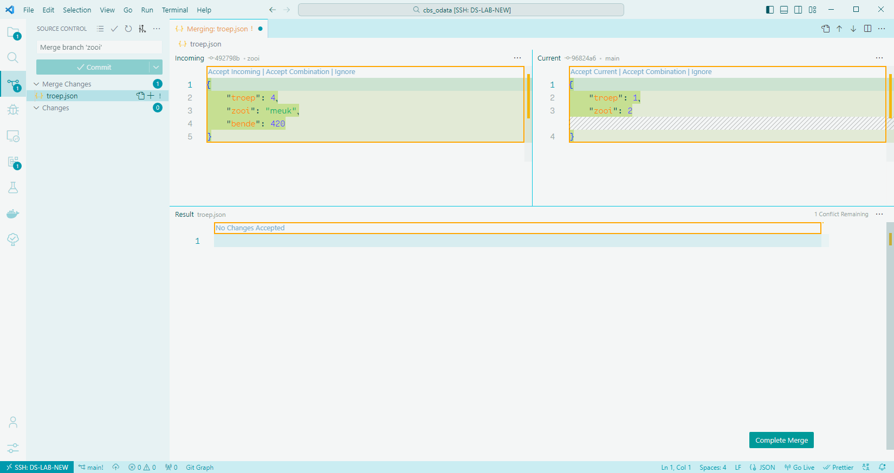
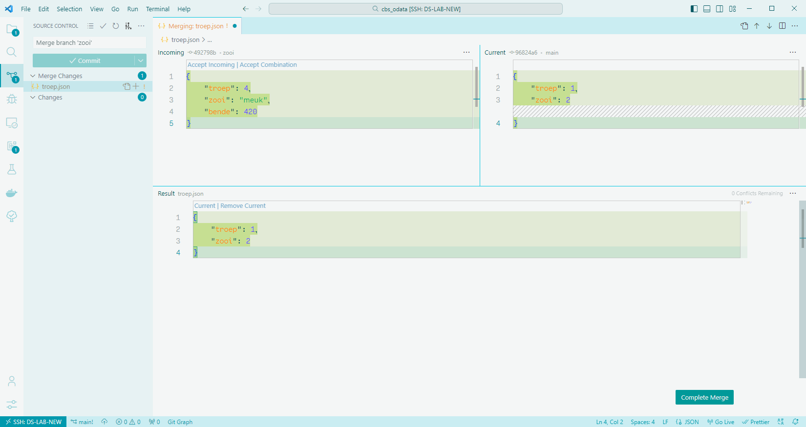
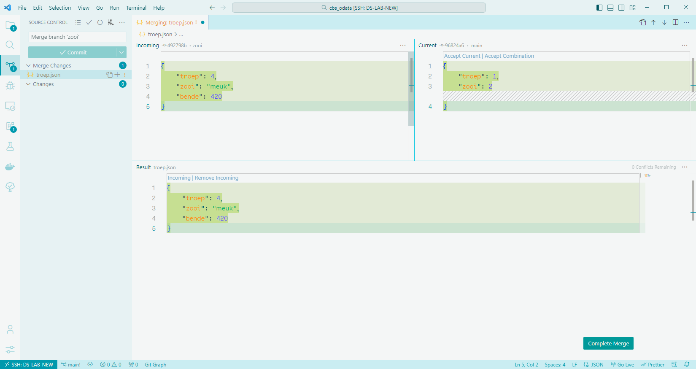
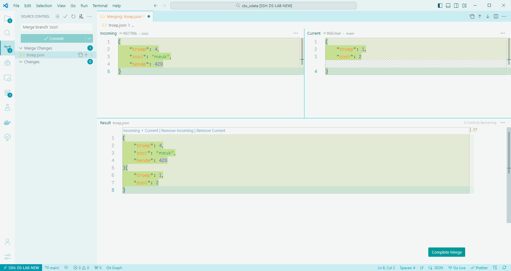
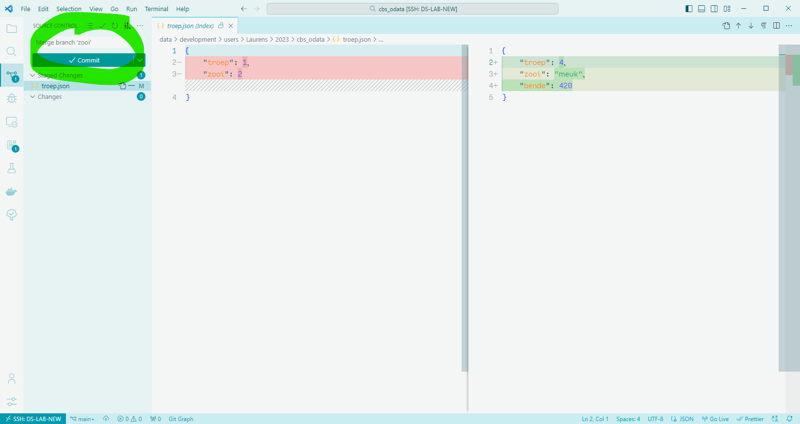

# Merge conflicts

Git is built with managing contributions from multiple developers on a single codebase in mind. In this way of working, it could happen that developers are editing, and committing, changes on the same files at the same time. When this occurs, a conflict may arise upon merging the changes.

The observant reader will probably think: *"we can prevent that using separate, isolated branches, right?"*. This certainly does prevent some conflicts that could arise. However, it may still happen that, when merging branches from separate developers, merge conflicts arise nonetheless.

## Understanding merge conflicts

Upon the occurence of a merge conflict, Git is unable to automatically determine the correct state of the file. Git only communicates this to the developer conducting the merge (i.e. the unlucky person running `git merge`). 

Once a merge conflict has been detected by Git, it will mark the file as conflicted and halt the merging process. The developer can then resolve the merge conflict by indicating to Git which changes are correct, and should be merged, and which changes can be left out of the merge and discarded.

**Some cases where merge conflicts can occur:**

* When multiple developers have changed the same lines of code in a file, and then try to merge their work.
* When a developer deletes a file, even though another developer was working on altering it.

**A case where Git will simply not start the merge, and marks it as a conflict, is when the working directory is not clean:**

* When there are pending changes in the staging area, which still have to be committed.
* When there are detected changes in your files, which you first have to stage and then commit.

!!! tip
    If you are unsure how to resolve a merge conflict, run `git merge --abort`. This will immediately exit you from the merge and will return the branch to the state it was in before you initiated the merge.
    
    Now you have some breathing room to do some more research, or ask a more experienced colleague for help.

## Examples

The images below show how a merge conflict may be handled in *Visual Studio Code*.

### Arising merge conflict

A merge conflict has occured in one file. Both versions of the files, along with the conflicting lines, are shown.

{ data-title="Merge conflict" data-description="Example of how a merge conflict may look like in <i>Visual Studio Code.</i>" width="75%" }

### Possible solutions

To resolve a merge conflict, the developer has a couple of options at their disposal.

#### Accept current state

By accepting the current state, the incoming changes are dropped. The results are shown in the bottem panel in the UI.

{ data-title="Merge conflict: Accept current" data-description="The situation when the choice is made to accept the <i>current</i> state." width="50%" }

#### Accept incoming state

By accepting the incoming state, the current changes are dropped. The results are shown in the bottem panel in the UI.

{ data-title="Merge conflict: Accept incoming" data-description="The situation when the choice is made to accept the <i>incoming</i> state." width="50%" }

#### Accept both states

By accepting both states, the changes of both states are squeezed together. Carefully check the result when considering this option. In the example below, it is shown that accepting both states will result in syntactically invalid JSON, and will therefore break our code.

{ data-title="Merge conflict: Accept both" data-description="The situation when the choice is made to accept <i>both</i> states." width="50%" }

### Accept a solution

After selecting your resolution (in this example: accept incoming changes), and hitting the *Confirm Merge* button, the merge conflict will have been resolved. You can now commit your changes.

{ data-title="Merge conflict: Use incoming" data-description="Resolving the merge conflict, using the <i>incoming</i> changes." width="75%" }