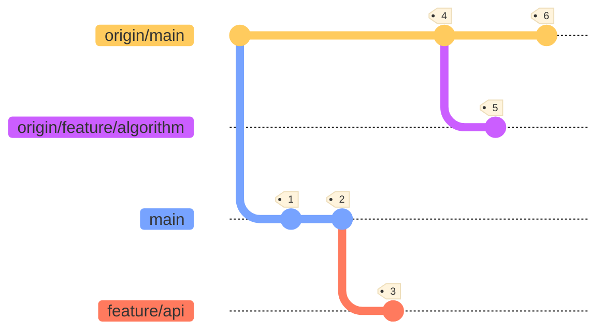

# Remote Branches

When working with remote repositories, you get so-called remote-tracking branches. Remote-tracking branches are references to the state of remote branches. The names of these branches take the form of `<remote>/<branch>`, e.g. `origin/development`. 

You cannot directly manipulate these branches yourself. Git will automatically do this whenever any network communication occurs to make sure they accurately represent the state of the remote repository.

> Think remote-tracking branches as bookmarks: they remind you where the branches in your remote repositories were the last time you connected to them.

## Manipulating Remotes

When you clone a repository, using `git clone`, Git will automatically know the location of the remote. However, you can also manually add or remove remotes:

```bash
# Manually add a remote for the current repository: git remote add <name> <url>
git remote add origin git@ssh.dev.azure.com:v3/deltafibernl/BICC/Placeholder

# Manually remove a remote for the current repository: git remote rm <name>
git remote rm origin
```
## Example

Consider the example below:

- `origin/main`: Remote-tracking branch of remote `main` branch.
- `origin/feature/algorithm`: Remote-tracking branch of remote `feature/algorithm` branch.
- `main`: Local state of `main` branch.
- `feature/api`: Local `feature/api` branch.

The following happens:

1. The repository is cloned locally.
2. A commit is made in `main` (local).
3. A new branch `feature_api` is made and a commit is made in it (local).
4. A collaborating developer pushed a commit to the remote `main` branch, reflected in remote-tracking branch `origin/main`.
5. A collaborating developer pushed a new remote branch `feature/algorithm` with a commit in it, as reflected in remote-tracking branch `origin/feature/algorithm`.
6. A collaborating developer pushed another commit to the remote `main` branch, reflected in remote-tracking branch `origin/main`.

> Note that we do not locally have the remote changes, made by the collaborating developers, until we retrieve them (either using `git fetch` with `git merge`, or `git pull`).

