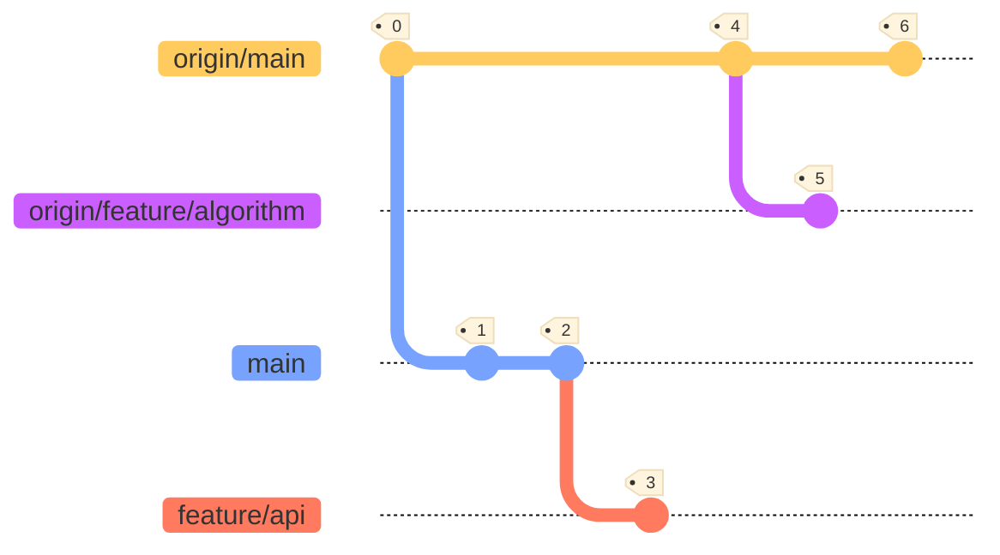

# Remote Branches

When working with remote repositories, you get so-called *remote-tracking branches*. Remote-tracking branches are references to the state of remote branches. The names of these branches take the form of `<remote>/<branch>`, e.g. `origin/development`. 

You cannot directly manipulate these branches yourself. Git will automatically do this whenever any network communication occurs, in order to make sure they accurately represent the state of the remote repository.

!!! info
    Think of remote-tracking branches as bookmarks: they remind you what the branches in your remote repositories contained the last time you connected to them.

## Manipulating Remotes

When you clone a repository, using `git clone`, Git will automatically register the location of the remote. However, you can also manually add or remove remotes:

```bash
# Initialise an empty repository for illustration purposes
git init

# Manually add a remote 'origin' for the current repository
git remote add origin git@ssh.dev.azure.com:v3/deltafibernl/BICC/Placeholder

# Manually remove remote 'origin' for the current repository
git remote rm origin
```
## Example

Consider the example below:

- `origin/main`: Remote-tracking branch of remote `main` branch.
- `origin/feature/algorithm`: Remote-tracking branch of remote `feature/algorithm` branch.
- `main`: Local state of `main` branch.
- `feature/api`: Local state of `feature/api` branch.



**The following has happened here:**

1. The repository is cloned locally from the remote state at commit tag `0`.
2. Commit tag `1` & `2`:
      * Two commits are made in `main` (local).
3. Commit tag `3`:
      * A new branch `feature_api` is made from `main` and a commit is made to it (local).
4. Commit tag `4`:
      * A collaborating developer has pushed a commit to the remote `main` branch, reflected in remote-tracking branch `origin/main`.
5. Commit tag `5`:
      * A collaborating developer pushed a new remote branch `feature/algorithm` (branched from `main`) with a commit in it, as reflected in remote-tracking branch `origin/feature/algorithm`.
6. Commit tag `6`:
      * A collaborating developer pushed another commit to the remote `main` branch, reflected in remote-tracking branch `origin/main`.

!!! note
    Note that we do not physically have the remote changes, as made by the collaborating developers, in our local repository until we explicitly retrieve them. This retrieval can be done using either `git fetch` paired with `git merge`, or using `git pull`. This will be covered in the next section.
