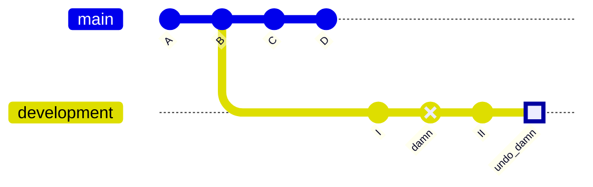

# Revert & Reset

It may happen that you make a mistake in a commit and want to undo this. There are several ways to go about this, but I will discuss `git revert` and `git reset` here.

## Revert

`git revert` is the friendly way of undoing a commit and, frankly, the only socially acceptable way to do it if you are working in remote repositories with a lot of contributors.

It works in the way that it adds a new commit to the current branch that undoes the changes of the commit you want revoked. For example, if the unwanted commit adds "123" to the bottom of the file, the revert on that commit will remove "123" from the bottom of that file.

### Example

We have accidentally committed a change in the `development` branch with commit ID `damn`. We want to use `git revert` to undo this change.

```bash
# Ensure we are checked out in the right branch
git checkout development

# Revert the unwanted comment
git revert damn
```

<br />


