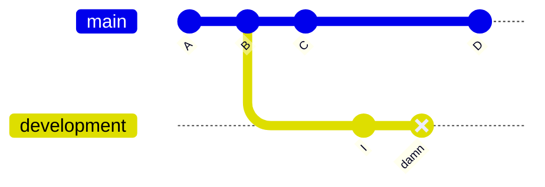
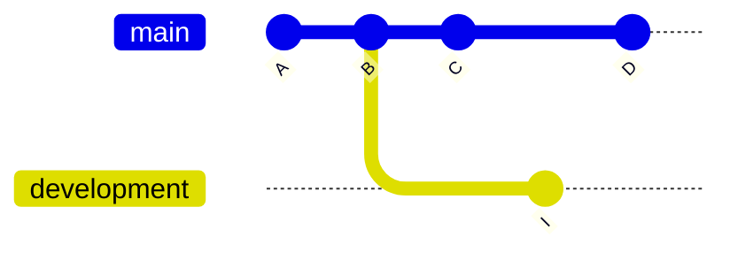

# Reset

`git reset` is primarily a way to clear staged changes. Consider the following example:

```bash
# Let's stage two arbitrary files
git add script.py
git add README.md

# If we would want to unstage README.md
git reset README.md

# Or if we would want to unstage all files
git reset
```

However, the command also be made a lot meaner by using the `--hard` argument. This way, the command can be used to hard delete commits. Comments reset this way will be entirely removed from the commit history and cannot be retrieved.

## Example

We have accidentally committed a change in the `development` branch with commit ID `damn`. We want to use `git reset --hard` to completely obliterate this mistake from the annals of history.

<br />



```bash
# Ensure we are checked out in the proper branch
git checkout development

# Hard reset the branch one commit back from the current checked-out state
git reset --hard HEAD~1
```

<br />

This will result in the following commit history:

