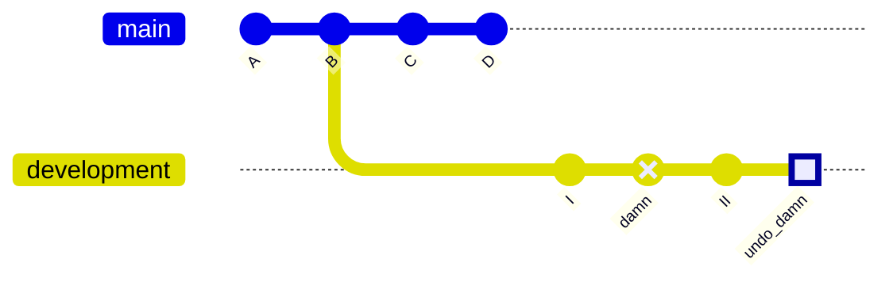
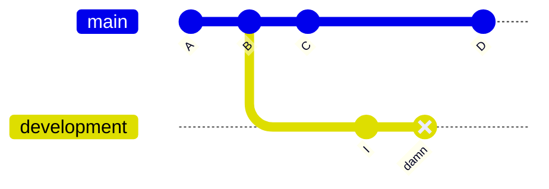
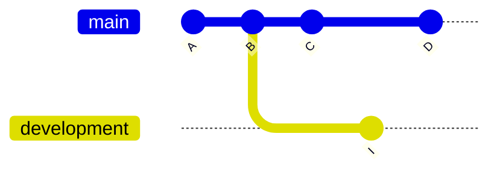

# Revert & reset

## Revert

`git revert` is the friendly way of undoing a commit and, frankly, the only acceptable way to do it, if you are working in remote repositories with a lot of contributors.

`git revert` adds a new commit that will undo the changes of the commit you want revoked. For example, if an unwanted commit adds the text *"Oops, my cat is walking over my keywalrhlgk"* to the bottom of a specific file, a revert on that commit will remove *"Oops, my cat is walking over my keywalrhlgk"* from the bottom of that file. It will effectively restore it to the state before that commit had been made.

The great thing is that both your *mistake*, and the correction of said *mistake*, are preserved in your history. Thus, making it fully *non-destructive*.

### Example: `git revert`

We have accidentally committed a change in the `development` branch with commit hash `damn`. We want to use `git revert` to undo this change.

```bash
# Ensure we are checked out in the right branch
git switch development

# Revert the unwanted commit
git revert damn
```



The commit with hash `undo_damn` has now removed the changes made by commit `damn`.

## Reset

`git reset` will move a branch to a commit back in time, in the sense that it appears as if the commit had never been made in the first place.

```bash
# Checkout the branch that has the commit we want to reset
git switch development

# Reset the branch, discarding the current commit
git reset HEAD

# Reset the branch, discarding the last three commits
git reset HEAD~3
```

`git reset` is also a way to clear changes that have been staged pending a commit, using `git add`. Consider the following example:

```bash
# Let's stage two arbitrary files
git add script.py
git add README.md

# If we would want to unstage README.md
git reset README.md

# Or if we would want to unstage all files
git reset
```

However, the command can also be modified using the `--hard` flag. This way, the command can be used to hard delete commits. Commits reset this way will be entirely removed from the commit history - and file history - and cannot be retrieved. It is therefore fully destructive.

### Example: `git reset --hard`

We have accidentally committed a change in the `development` branch with commit hash `damn`. We want to use `git reset --hard` to completely obliterate this mistake from the annals of history.



```bash
# Ensure we are checked out in the proper branch
git switch development

# Hard reset the branch one commit back from the current checked-out state
git reset --hard HEAD~
```

This will result in the following commit history:



??? info "`git reset` parameters: `--soft`, `--mixed`, `--hard`"
    - **`git reset --soft`:** Keeps files intact and moves the changes back to the *staging area*.
    - **`git reset --mixed`:** The default option, if you do not specify one explicitly. Keeps files intact, but removes them from the *staging area*.
    - **`git reset --hard`**: Completely eradicates changes and removes them from the repository, and local filesystem, entirely.