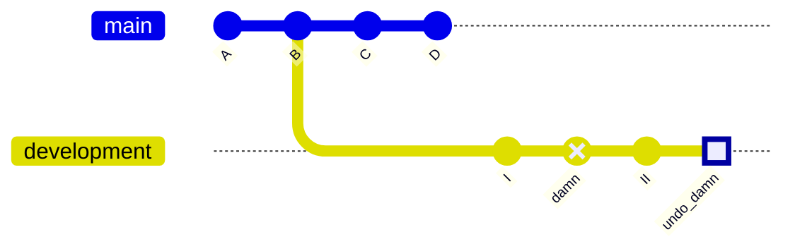
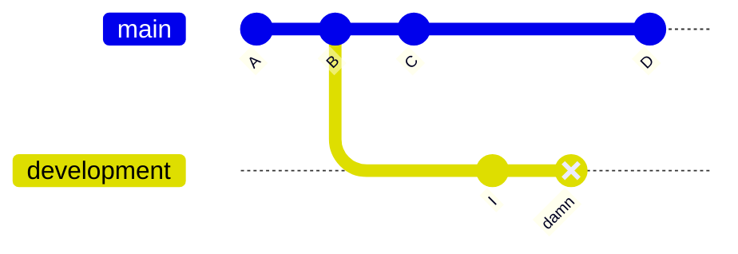
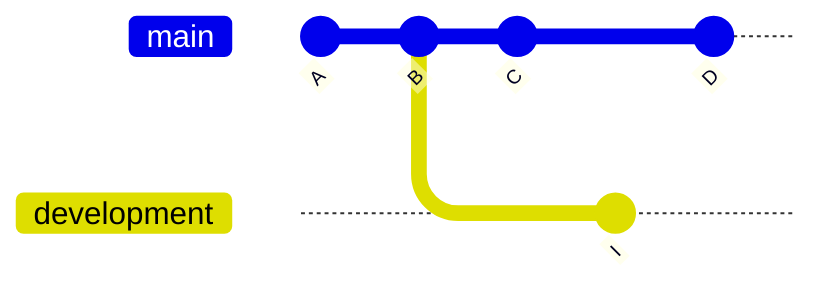

# Revert & reset

## Revert

`git revert` is the friendly way of undoing a commit and, frankly, the only socially acceptable way to do it, if you are working in remote repositories with a lot of contributors.

It adds a new commit to the current branch that will undo the changes of the commit you want revoked. For example, if an unwanted commit adds the text '123' to the bottom of a specific file, a revert on that commit will remove '123' from the bottom of that file. It will effectively restore it to the state before that commit had been made.

### Example: `git revert`

We have accidentally committed a change in the `development` branch with commit ID `damn`. We want to use `git revert` to undo this change.

```bash
# Ensure we are checked out in the right branch
git switch development

# Revert the unwanted commit
git revert damn
```



The commit with ID `undo_damn` has now removed the changes made by commit `damn`.

## Reset

`git reset` will move a branch to a commit back in time, in the sense that it appears as if the commit had never been made.

```bash
# Checkout the branch that has the commit we want to reset
git switch development

# Reset the branch, discarding the current commit
git reset HEAD
```

`git reset` is also a way to clear changes that have been staged, using `git add`. Consider the following example:

```bash
# Let's stage two arbitrary files
git add script.py
git add README.md

# If we would want to unstage README.md
git reset README.md

# Or if we would want to unstage all files
git reset
```

However, the command also be made a lot meaner by using the `--hard` argument. This way, the command can be used to hard delete commits. Commits reset this way will be entirely removed from the commit history and cannot be retrieved. It is therefore destructive.

### Example: `git reset --hard`

We have accidentally committed a change in the `development` branch with commit ID `damn`. We want to use `git reset --hard` to completely obliterate this mistake from the annals of history.



```bash
# Ensure we are checked out in the proper branch
git switch development

# Hard reset the branch one commit back from the current checked-out state
git reset --hard HEAD~1
```

This will result in the following commit history:

