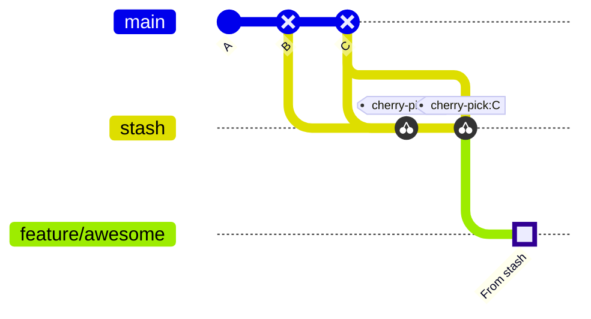

# Stash

Imagine you are hard at work writing amazing code for a new feature, and then you realize you are still checked out on another branch. That sucks. Or imagine you quickly need to change context within the repository, because a colleague asks for help, but the code changes you are currently working on are not ready to commit.

This is where `git stash` comes in.

## Example: `git stash`

```bash
# Stage some arbitrary changes in the INDEX
git add script.py
git add __init__.py
git add LICENSE

# Stash the changes
git stash

# Create the new branch and check it out
git branch feature/awesome
git checkout feature/awesome

# List all stashes to find index number associated with your stash
git stash list

# Apply the stash to the branch
git stash apply 0

# Commit the changes
git commit -m "From stash"

# Clean up the stash
git stash drop 0
```

I hacked together the visualisation below to give you some visual representation of what is going on. It is not entirely accurate, but I hope it conveys the idea.

<br />

